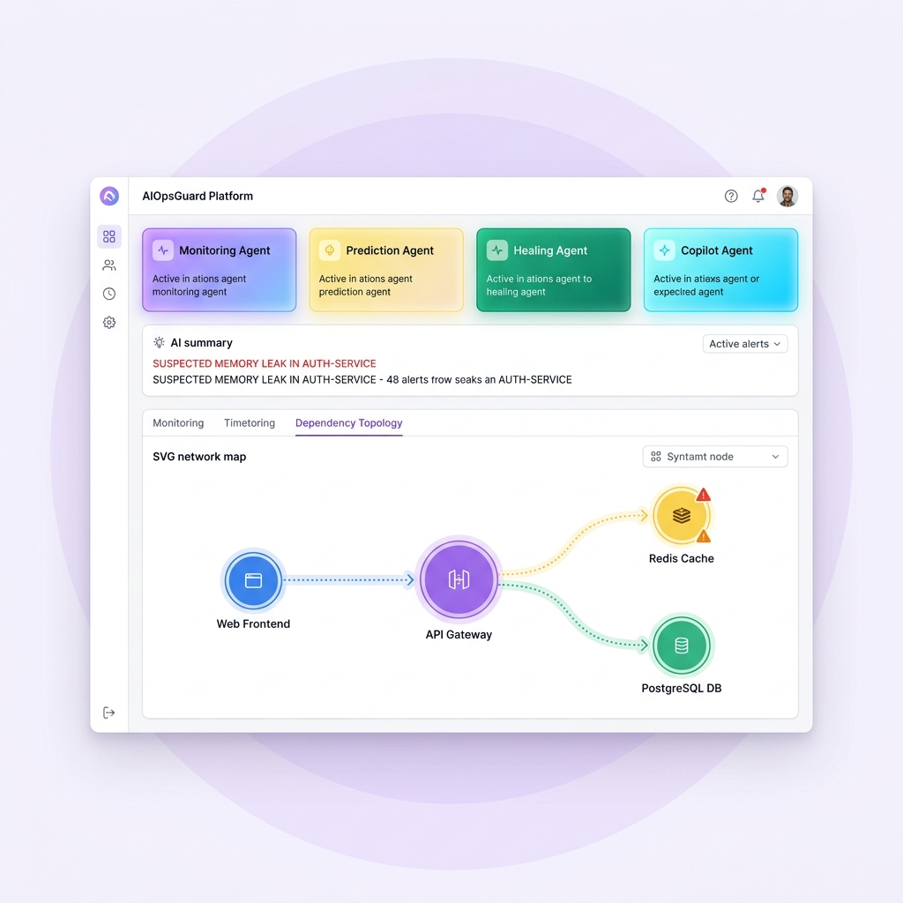
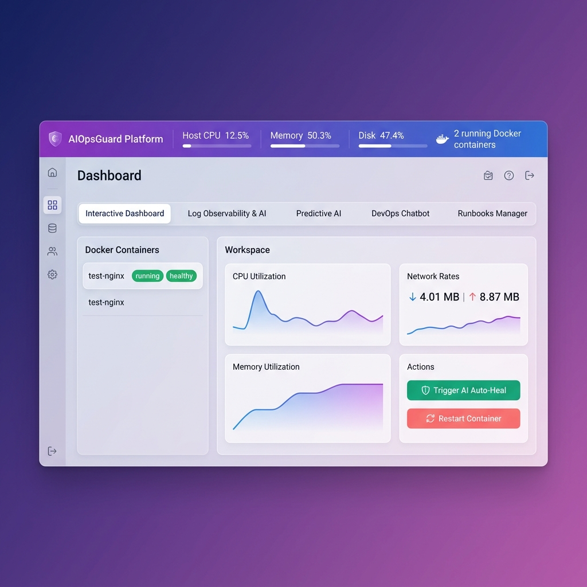

# AIOpsGuard Platform

### AI-Powered DevOps Observability, Automated Self-Healing & Incident Prediction

AIOpsGuard is an **Enterprise-Grade AI Observability & Agentic AIOps Platform** designed for real-time monitoring of Docker containers and host system resources. It functions as a **collaborative multi-agent collective** that parses system telemetry slopes, tails logs, predicts critical incident failures, and triggers self-healing container recoveries autonomously.

---

## 🎨 Interactive Topology Map & Agent Collective

Here is the premium modern glassmorphic dashboard interface developed for AIOpsGuard, displaying the active **AIOps Agent Collective** and the **SVG Infrastructure Topology Map**:



---

## 🖥️ Live Telemetry & Resource Graphing

When inspecting container-level workloads, AIOpsGuard renders real-time CPU and Memory trend charts dynamically using native responsive SVGs:



---

## ✨ Features & Capabilities

### 1. Collaborative Multi-Agent Collective Panel
Provides a visual status grid of four dedicated operational agents at the top of your dashboard:
- **📊 Monitoring Agent**: Scrapes host CPU, Memory, Disk space, and Docker container sockets.
- **🔮 Prediction Agent**: Analyzes sliding-window statistical derivatives to catch CPU spikes and memory leaks.
- **🛡️ Healing Agent**: Monitores container health indicators and invokes direct recovery events.
- **🤖 Copilot Agent**: Backs LangChain retriever QA engines for chatbot troubleshooting queries.

### 2. Interactive SVG Network Topology Map
A custom, zero-dependency interactive SVG network canvas:
- Dynamically maps `Web Frontend` → `API Gateway` → splits into `Redis Cache` and `PostgreSQL Database`.
- Glowing alert halos turn yellow/red based on active container health states.
- Moving dash strokes flow along link connections to represent active request load.
- Clickable nodes automatically populates the side drawer diagnostic board.

### 3. AI Incident Summary Hero Panel
Fuses log commentaries with metrics to display a highlighted alert bulletin summarizing active memory leaks, CPU thresholds, and imminent crashes on your dashboard.

### 4. Root Cause flowchart Visuals & Timelines
- Replaces raw logs with a structured HSL-tailored visual sequence chart:
  `🚨 Anomalous Issue` ➔ `🖥️ Affected Node` ➔ `🧠 AI Root Cause` ➔ `🛡️ Recommended Fix`
- Displays a vertical **Chronological Incident Feed** charting checks, leak forecasts, auto-healer triggers, and service restorations.

### 5. Failure Probability Gauges & Explainability
- Evaluates CPU/RAM slopes to compute failure probability percentages (e.g. `82%`).
- Features a **Why Evidence checklist** confirming precisely which indicators triggered the risk score.

### 6. CI/CD Deployment Releases & Rollbacks
- Connects to `/deployments` and `/deployments/rollback` routes in the backend.
- Displays commit versions, build outputs, failed compile logs, and allows manual rollbacks.

---

## ⚙️ Project Architecture

```
  [ React 19 / Vite UI ] ──► (Http Post/Get) ──► [ FastAPI Backend ]
                                                        │
         ┌──────────────────┬───────────────────────────┼──────────────────┐
         ▼                  ▼                           ▼                  ▼
    [ psutil OS ]    [ docker-py SDK ]             [ LangChain ]      [ ChromaDB ]
  (Host resources)  (Docker sockets daemon)       (OpenAI Chat QA)   (Vector Store)
```

---

## 📦 Project Directory Structure

```
AIOpsGuard/
├── backend/
│   ├── main.py                # REST API router & simulated CI/CD rollbacks
│   ├── docker_monitor.py      # Docker daemon client & volume socket binders
│   ├── incident_predictor.py  # Trend derivative & OOM slope forecasters
│   ├── ai_engine.py           # Log heuristics & OpenAI insights commentary
│   ├── devops_assistant.py    # LangChain retriever QA chat assistant
│   └── rag.py                 # ChromaDB Vector Store RAG controller
├── frontend/
│   ├── src/
│   │   ├── App.jsx            # Redesigned Topology and Observability UI
│   │   ├── App.css            # Refined pastel SaaS variables & keyframes
│   │   └── main.jsx
│   └── index.html
└── assets/                    # Project screenshot mockups
```

---

## 🚀 Installation & Local Startup

### Prerequisites
1. **Python 3.10+** and **Node.js 18+**.
2. Ensure the local **Docker daemon** (or Docker Desktop) is active on the host machine.
3. Configure `OPENAI_API_KEY` inside `backend/.env` to enable advanced OpenAI log commentary and RAG chat.

### 1. Start FastAPI Backend Agent

Activate the Python virtual environment and install backend packages:

```bash
# Navigate to the root directory
cd AIOpsGuard

# Activate venv (Windows)
.venv\Scripts\activate

# Force install psutil & python dependencies to site-packages
.venv\Scripts\pip.exe install -r backend/requirements.txt --target .venv\Lib\site-packages

# Start FastAPI server
cd backend
..\.venv\Scripts\python.exe -m uvicorn main:app --port 8000
```

Verify that the backend is alive by visiting `http://127.0.0.1:8000/system/metrics`.

### 2. Start Vite Frontend Server

Open a new terminal window:

```bash
cd AIOpsGuard/frontend

# Install node dependencies
npm install

# Start development server
npm run dev
```

Open **`http://localhost:5174/`** in your browser to interact with the AIOpsGuard platform!